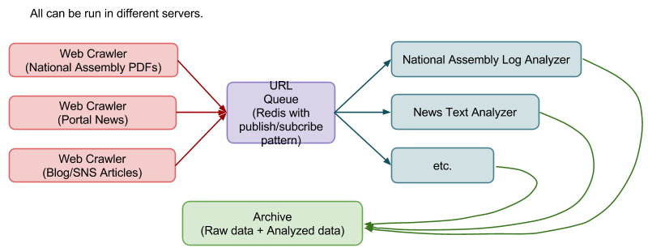

# 2011-03-26

## 리서치팀 미팅
이번주 회의 안건에 대한 이야기 입니다.
자, 지난 회의 때에도 이야기 했지만, 리서치팀의 목표는 대략 다음과 같습니다.
우리가 가지고 있는 정보들을 정의하고, 구조화 한 뒤,
다음 프로덕트에서 어떤 정보들을 보여주고, 무엇에 강조점을 둘 것인가,
그 기준은 무엇이고, 정당한가, (정당함에 대한 기준은, informative / entertaining 를 잠정적 기준으로 둡니다)
에 대한 답을 찾는 것입니다.

지금까지 우리의 공감대는,
어떤 방향으로 가면 좋을지 아이디어들은 산발적으로 많다.
하지만, 한 방향을 잡기에는, 뒷받침되는 근거 자료가 없기 때문에 어디로 가는 것이 맞는 것인지 확신이 서지 않는다.
입니다.
맞는 문제제기라고 생각하고요, 그래서 우리가 좀 더 체계적으로 연구된 자료를 바탕으로 접근을 해야하는 것이 옳지 않겠는가 하는 생각을 하게 된 것이 지난 3월 중순까지 진행된 우리의 논의 입니다.

=====================================

지난 1월 말쯤부터 갈팡질팡 해오던 논의를 위와 같이 정리를 해보았어요. (솔직히 2월달의 회의는 여러모로 불안불안하기도 했고 우리가 어디로 가나 많은 회의가 들기도 했죠? ㅎㅎㅎ)
정리를 하자면, 우리가 좀 더 체계적인 연구를 바탕으로 논의를 진행해보자는 것입니다.
(https://github.com/teampopong/teampopong.github.io/blob/source/docs/2011-03-12.md 참고)

그래서 j****가
https://sites.google.com/a/popong.com/wiki/references/2cha-jalyo
이 페이지에 쓸모 있어보이는 논문들을 긁어왔어요
하지만 아직 완전히 다 리뷰되지는 않은 상황입니다
그 중에 중요하다 판단되는 것부터 우선적으로 리뷰하면서 회의를 진행할 생각입니다

즉, 앞으로의 작업은, 이런 레퍼런스들에서 우리 서비스에 적용되면 좋을만한 인사이트를 잡아내는 방향이 될 것이지, 싶습니다
그래서 아래와 같이 논문들을 한 번 스킴을 해주고 오면 좋겠어요

주성, 은정
https://docs.google.com/a/popong.com/viewer?a=v&pid=sites&srcid=cG9wb25nLmNvbXx3aWtpfGd4OjMyZWJmYmY2MTM0ODJiNTY

ganzi, 혜민
https://docs.google.com/a/popong.com/viewer?a=v&pid=sites&srcid=cG9wb25nLmNvbXx3aWtpfGd4OjM2MThlY2Y1MGZjMmVjZDE
https://docs.google.com/a/popong.com/viewer?a=v&pid=sites&srcid=cG9wb25nLmNvbXx3aWtpfGd4OjM3ZTk5Mjc2MGFmYWIxZjQ

사실, 주성하고 은정은 지금 진행중인 개발 업무가 있죠?
그래서 이걸 읽어오라고 하는게 좀 미안하긴 한데, ㅎㅎㅎ
j****가 이 논문을 읽어보고, 주성하고 은정이 여기서 해줄 수 있는 역할이 있을 것 같다고 해서 한 번 읽어봤으면 하는거에요.

토요일에 같이 이야기해봅시다~

======================================

3/12 일 회의록에도 써있지만,
우리가 이 리서치를 진행하는 방향은,
논문 검토
신문기사/블로그 등 검색
이 될 것이고.. 그 방향 검토에 대해서는,
한** 교수, 박** 교수의 자문
을 요청할 수 있을 껍니다.
위의 내용은, 논문 검토 진행인 것이고요..

한** 교수와 박** 교수하고의 커뮤니케이션을 앞으로 어떻게 계속 지속할 것인가도 같이 고민을 좀 해봐야 할 것 같네요.
이건, 우리 프로젝트 팀원 전원하고 같이 고민해야 할 내용인 것 같은데요,

현재까지는 제가 커뮤니케이션 창구로서 역할을 하고 있습니다.
이런 방식의 장점은,
커뮤니케이션의 명확성, 관련된 의사 결정의 신속성
프로젝트 내에서의 영향력 제한, 팀내 사기 저하 요인 통제
가 있습니다만, 반대로 단점은,
한**, 박** 교수의 프로젝트 이해도 저하
그로 인한, 협력 가능 수준의 저하
의 문제가 있어요
커뮤니케이션 창구를 좀 더 확대시킬 경우에는 어떻게 될지 각 pros/cons 를 반대로 생각해보면 알 수 있겠죠.

고민해볼 문제예요..

## 리서치팀 + 개발팀 joint 미팅

### Pithy팀(service prototyping)

- 각자 next To-dos
    - 주은광
        - 참여연대에 데이터 요청 문서 작성, 전달
    - ganzi
        - 홈페이지에 들어갈 데이터 specification 작성
        - PPT 로 가상으로 만들어서 김미정이 디자인에 감을 잡을 수 있도록 전달해주기
    - 김미정
        - 디자인 테마 결정
        - 지도 이미지 따기
    - 이수현
        - popong 개발 서버에 java 설치

### 리서치팀(data platform)

- Next To-do (1은 김준기 담당, 2는 박주성/박은정 담당. 3은 나중에.)
    1. 크롤러 프레임워크 작성
        - 분산 처리 가능하도록: HTML parser & URL retreiver (Python) -> Queue (Redis) -> PDF Parser & Text analyzer (Java)
        - 현재는 국회 본회의록·상임위 회의록·법안 발의 등을 대상으로 하지만, 나중에 뉴스 기사 등도 추가할 수 있도록.
        - 일단 HTML 기능으로 publish된 그림으로 넣어봅니다;

        

    2. 현재 크롤링된 PDF들 중에 샘플을 몇 개 뽑아서 키워드 추출, 누가 무엇을 언급했는지 추출
        - raw data를 어디까지 refine할 수 있는지부터 살펴봅시다.
    3. Sentiment analysis (누가 무엇에 대해 "어떤 입장으로" 언급했는지 추출)
- Crawler + Parser에서 나왔으면 하는 내용
    - "나와 정치 성향이 비슷한 의원은?"
    - 성향별로 정치인 분류해보기 / 정치인별로 정책주제마다 어떤 입장인가?
- 문제점
    - 의원들의 성향을 판단할 criteria를 무엇을 포함시켜야 하는지, 그러한 criteria를 어떤 방법·어떤 소스로 알아내야 하는가? -> 한** 교수에게 질문...?
- 기타 긁어봤으면 하는 데이터
    - 공직자 재산 공개 내역 (최근 3~5년 정도?) -> 데이터 입력은 공직자 윤리 위원회(?)에서 하는 듯
