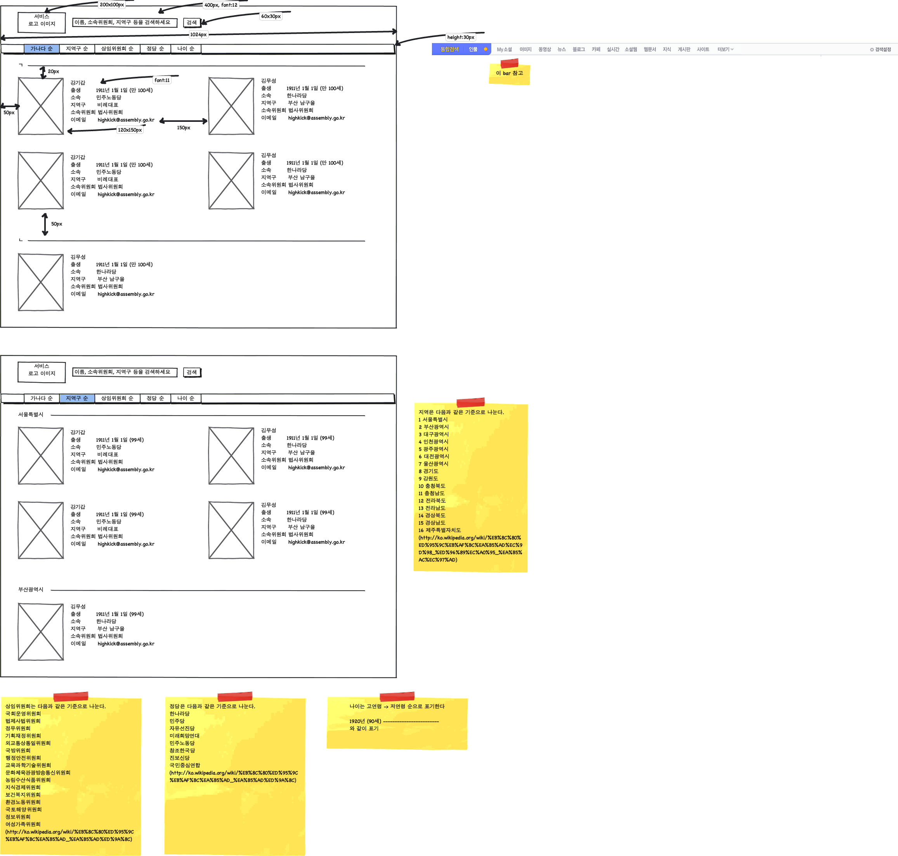

# Plan-pithy

## To-dos
- 1순위
    - 검색 기능 완성
        - 이름, 지역구 (경기, 안양시, 만안구, 각각 따로, 비례), 상임위, 정당 별로 검색 가능
        - 페이지 리로딩 없이 검색
        - (자동완성 기능...? ㅎㅎㅎ)
    - 사진 수집하기
    - 가,나,다 구분하기
    - 지역구, 상임위, 정당, 나이 섹션 완성
- 2순위
    - 각 줄별 높이 동일하게 맞추기
        - 각 줄에서 높이가 가장 긴 박스의 높이에 맞추기
        - 웹브라우저 폭의 변화에 따라 responsive 하게 동작
    - 프로필 항목 중 지역구를 무조건 한 줄로 맞추기 -> 즉, 각 의원별 박스의 행 길이를 가장 긴 지역구 이름의 길이에 맞추면 될 듯.
    - 프로필 항목별 데이터가 같은 위치에서 시작하도록 줄 맞추기. 예컨대, 다음과 같이,

            이름            김소남
            출생            1922/12/2
            소속위원회      외교통상위원회,윤리특별위원회
            이메일          ㅁㄴㅇㄹ@네이버닷컴

## 기본 레이아웃 (v0.1)

- 참고사이트
    - 상임위, 정당 순서 http://ko.wikipedia.org/wiki/%EB%8C%80%ED%95%9C%EB%AF%BC%EA%B5%AD_%EA%B5%AD%ED%9A%8C
    - 행정구역 순서 http://ko.wikipedia.org/wiki/%EB%8C%80%ED%95%9C%EB%AF%BC%EA%B5%AD%EC%9D%98_%ED%96%89%EC%A0%95_%EA%B5%AC%EC%97%AD
    - 다음 검색결과
- 학교, 출생지 별 분류 탭도 있어야 하나, 그건 parsing 을 한 단계 더 해야 해서 다음 단계에 완성하는 것으로 하자.
- 기술 스펙
    - 지원 브라우저 최하 버전 : IE7, firefox3.5, safari 4, chrome 9 (http://trend.logger.co.kr/trendForward.tsp?TSPSESSIONID=d72171a8047f442163d9936562ccbf07)
    - 검색
    - 모바일?
