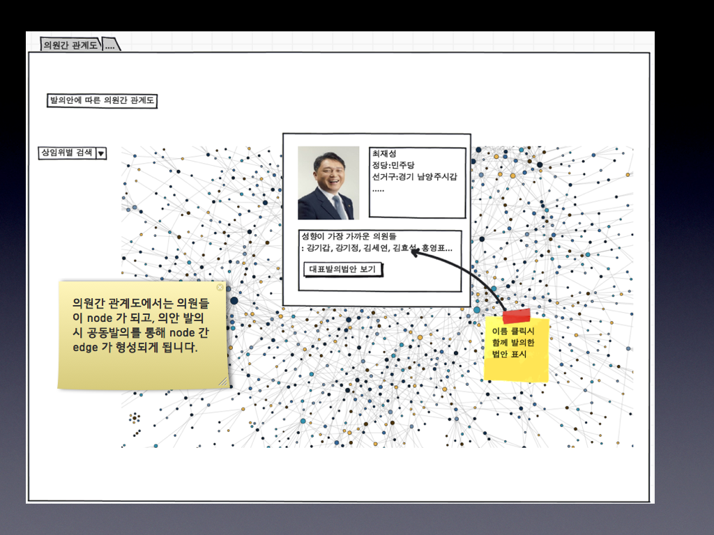
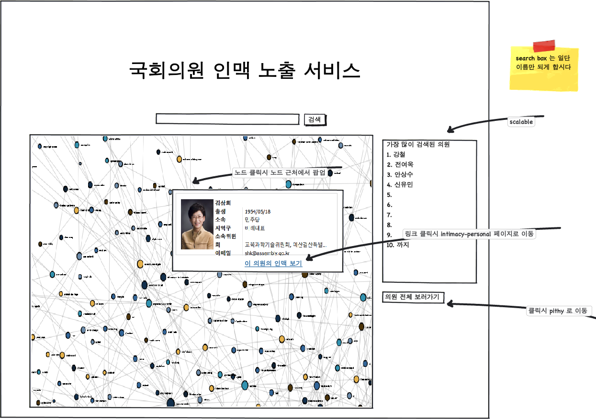
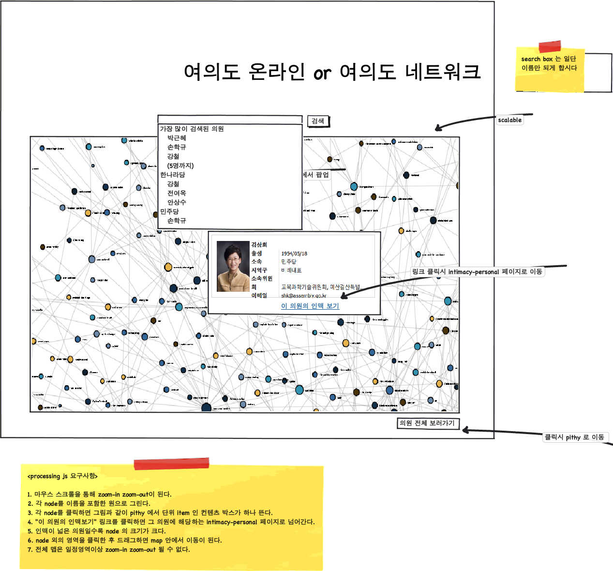
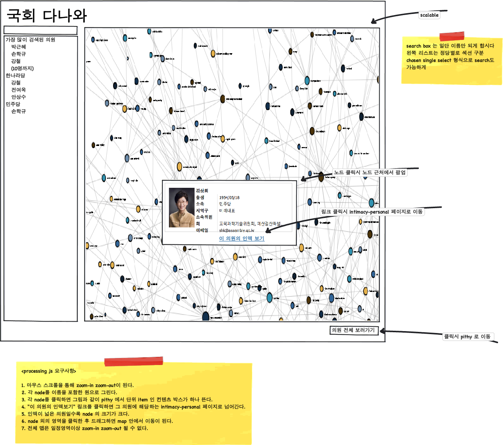
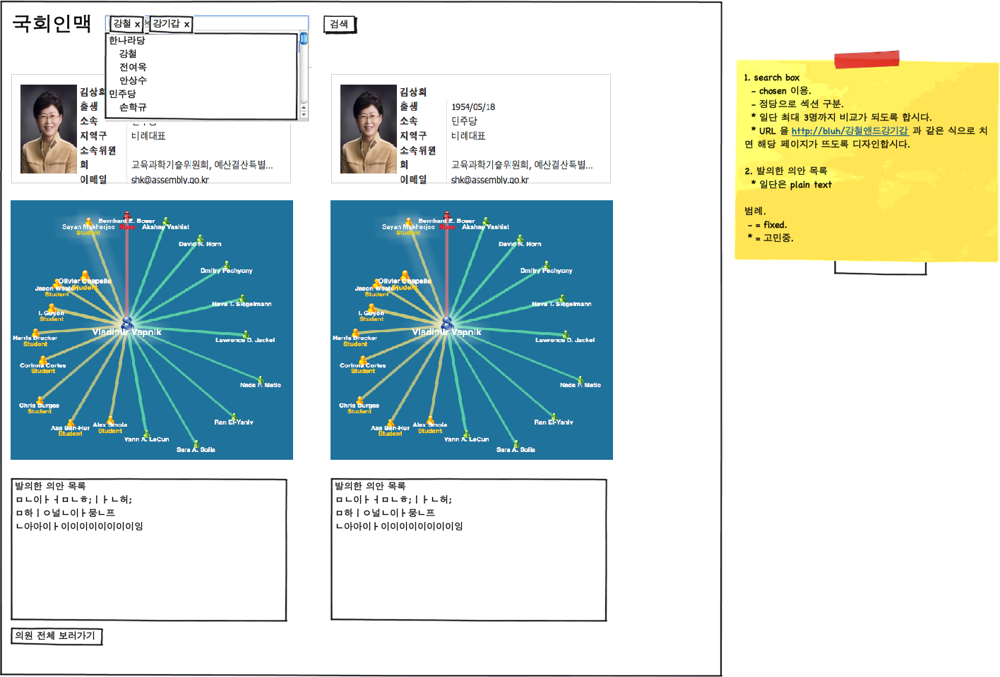
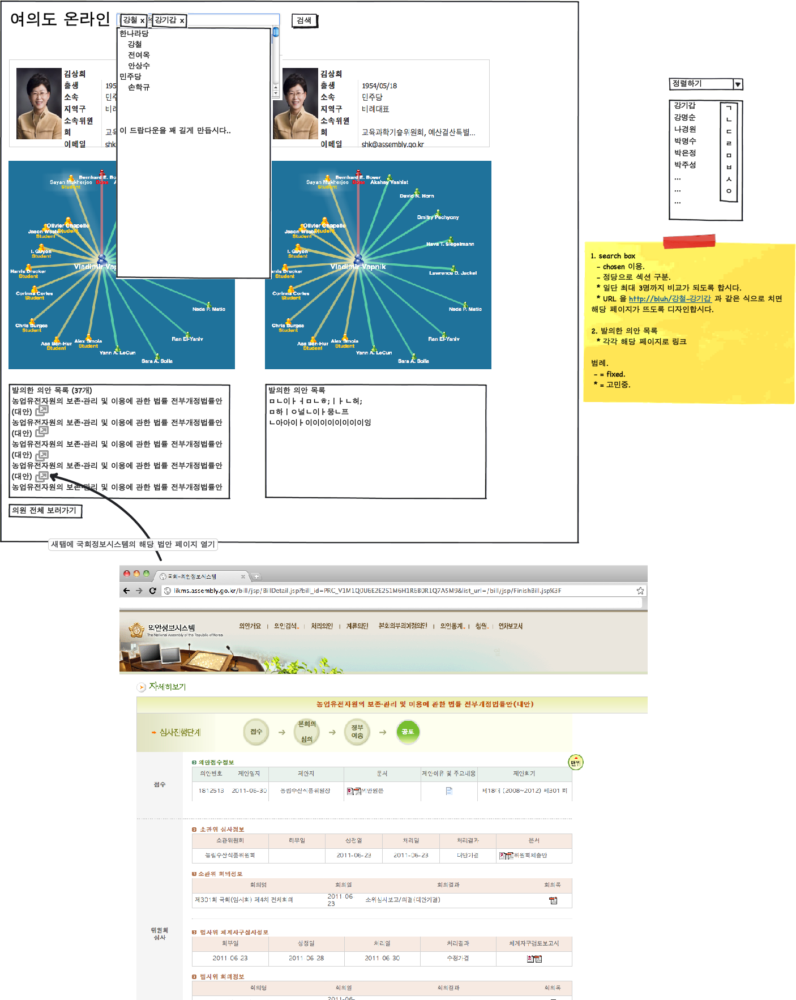
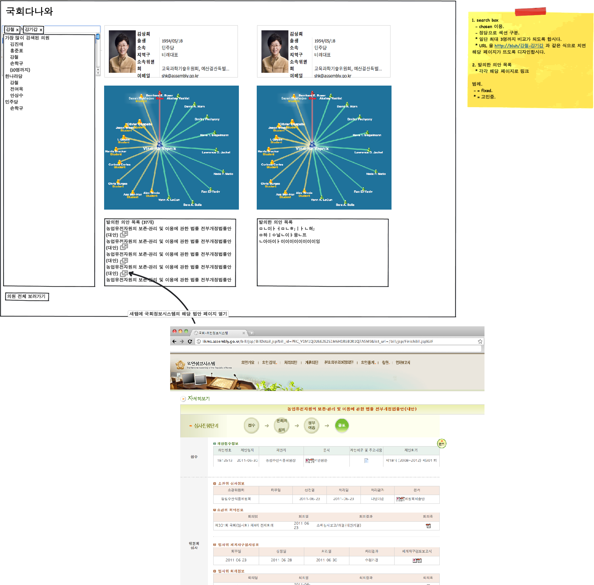

# Plan-intimacy

## 2011-07-02: 국회 의안 정보 수집 1차 계획

1. 국회 의안정보시스템에 들어가면
    - 처리의안 http://likms.assembly.go.kr/bill/jsp/FinishBill.jsp
    - 계류의안 http://likms.assembly.go.kr/bill/jsp/MooringBill.jsp

    이 있다.
    각각에 대해서도 여러 탭이 있는데, 당연히 제일 왼쪽에 있는 전체 탭에서 정보를 수집한다.

    위의 의안정보시스템에서 1차적으로 추출할 데이터는,

    - 의안 고유번호 Bill ID
    - 의안명 Bill Name
    - 소관위원회 Committee
    - 제안일자 Bill Date
    - 제안자 분류 Proposer Category  (0: 정부 Government, 1: 위원장 Chairperson, 2: 의원 committeeman)
    - 제안자 Proposer
    - 제안자 분류가 0 일 경우 : "정부" 로 기입.
    - 제안자 분류가 1 일 경우 : "지식경제위원회 위원장" 즉, 소관 위원회 이름을 기입.
    - 제안자 분류가 2 일 경우 : "태연, 윤아, 제시카, 티파니" 제안자 명단을 콤마 (,) 로 구분하여 기입.
    - 처리 여부 Status Flag (0: 처리 Finished, 1: 계류 Mooring)
    - 처리 상태 Status Detail (원안가결/수정가결/대안폐기/철회/폐기/경과보고서채택)
    - 의결일 Decision Date (계류 상태일 때는 null)

    이다.
2. 의원 정보

    http://www.assembly.go.kr/renew10/mem/mem/mem_search.jsp 에서 수집 할 수 있다. 사진을 클릭하면 팝업 윈도우가 뜨고 개인별 정보가 나온다.

    - 의원 이름 Name
    - 의원 영문이름 EnglishName
    - 생년월일 BirthDate
    - 지역 District
        - 지역대표: 서울, 경기, 인천, 대구, ...
        - 비례대표: 일괄적으로 "비례"
    - 지역구 District2
        - 지역대표: 성동구, 양주시동두천시, 남구, ...
        - 비례대표: 일괄적으로 null
    - 지역구구분 District3
        - 지역대표: 갑/을/병 만 표기
        - 비례대표: 일괄적으로 null
    - 소속 위원회 Committee (2개 이상 가능함, 컴마로 구분)
    - 위원장 구분 ChairPerson
        - 본인이 위원장인 위원회 이름 기입. 2개 이상일 경우 컴마로 구분
        - 없을 경우 null
    - 소속 정당 Party
    - 당선 회수 ElectedCount (1,2,3,...)
    - 당선 회기 ElectedSession : 15, 17, 18 등 컴마(,) 로 구분
    - 사무실 전화 Phone
    - 홈페이지 Homepage
    - 이메일 Email
    - 약력 Profile (각 개인별 팝업 페이지에 있는 약력을 그대로 dump)
3. 위원회 정보
    상임위원장 정보 (http://www.assembly.go.kr/renew10/asm/stdcom/stdcom_list.jsp) 페이지에서 정보를 가져온다.
    1. 항의 제안자 분류가 위원장일 경우, 이 정보와 매치시켜 위원장의 이름을 기입한다.

    - 위원회 이름 CommitteeName
    - 위원장 이름 ChairPersonName
    - 위원 명단 CommitteeRoll

일단 내가 잡은 틀은 위와 같은데, 구현상의 편의를 위한 변경 사항 (예컨대, 위원장 구분을 컴마로 구분하는 대신, 다른 방식으로 저장한다든가...) 이나, 최적화된 DB 설계는 준기한테 맡김... ㅋㅋ

그 밖에 염두에 두어야 할 사항은,
프로세싱해야 할 정보가 향후 확장가능하다.
계류법안은 정기적으로 처리법안으로 넘어가게 되니, Bill ID 로 검색해서 정보를 update 해야 한다.
정도임.

## 2011-07-09: 국회 의안정보 수집 2차 계획

크롤러의 다음 단계는,

1. 각 법안별 페이지에서 상세 정보 긁어오기
    1. 각 법안별 페이지 html
        1. 일단 html 구조 그대로 다 크롤링해서 저장해둔 뒤에, 후에 정보가 필요할 때마다 꺼내서 쓰도록 하자.
        1. 법안마다 정보 양의 차이가 들쭉날쭉하고, 기획이 확정되지 않아서, 현재 상태에서 필요한 정보를 finalize 하기가 좀 힘든 것 같아.
        1. 일단 각 법안 id 를 primary key 로 해서 html dump 와 그 안에 있는 pdf, hwp 첨부파일들을 잘 link 시킨 상태로 db화 하는 것을 목표로 하자.
    1. 각 법안별 페이지에서 pdf 첨부파일들 다운받기
        1. pdf 파일들은 현재 mongodb 구조 상 하나의 document에 4MB 이상의 내용을 넣을 수 없어서 파일로 따로 archiving을 해야 할 것 같습니다. 그리고 hwp 파일들도 함께 있는데 hwp 파일 형식이 공개되어 있기 때문에 향후 좀더 상세한 분석을 위해서는 pdf와 함께 hwp도 저장해두는 편이 좋을 것 같네요.
1. 지속적으로 법안상태 업데이트하기
    1. 계류 -> 처리법안으로 상태가 넘어 왔을 경우 업데이트하기 (즉, 처리법안에 새롭게 들어오는 법안 목록만 크롤링하는 옵션)
        1. 계류 -> 처리법안으로 넘어올 때 내부 정보들이 업데이트 되거나 추가될 수 있기 때문에 새로 크롤링을 한다.
    1. 계류 법안에 새로운 법안 목록이 생기면 새로운 것만 크롤링하기
        1. db에 저장된 법안들의 ID만 모두 가져와서 set diff를 뜬 다음 새로 추가된 것만 의원정보를 긁어온다.
    1. 기타
        1. 크롤링 주기는 하루 한번으로 한다.
        1. 똑같은 URL+parameter로 요청한 페이지더라도 과거에 크롤링했던 것을 보존할 것인가 덮어써서 업데이트할 것인가 하는 문제가 있는데 특별히 용량이 문제되지 않는다면 보존하는 쪽으로 한다.
3. 리뉴얼된 국회 홈페이지에서 국회의원 프로필 크롤링하기
4. 열려라 국회 데이터 크롤링하기

이렇게 될꺼야

일단 4번은 마지막으로 놓고.
1,2번 같은 경우, 크롤러가 그냥 무조건 한 번 긁어올 때마다 다 긁어온 뒤에 디비 넣을 때 대조하면서 넣을 것인가, 좀 더 스마트하게 긁어올 것인가, 하는 점을 생각해봐야 할텐데
우리가 긁어오는 주기에 따라 달라지겠지
고려할 사항이 많아진다 싶으면 현재처럼 통으로 긁어와서 디비화 할 때 update/insert 를 하면 될꺼 같고.
그건 판단에 맡길께

## 2011-07-20: 페이지 구성 계획

1. 의원 1인에 대하여
    1. 친밀한 의원 표기
    1. 발의 의안의 통과 확률 (원안통과, 대안통과, 폐기, 철회 등의 비율)
    1. factor를 정의한 뒤 성향분석
        1. durability ; 꾸준히 발의하는가
        1. diversity ; 다양한 상임위 의안에 발의하는가
        1. tolerance ; 다른 정당인이 대표발의한 법안에 공동발의하는가
        1. 등의 factor 를 정의한 뒤 방사 그래프로 표기
1. 여러 의원에 대하여
    1. 전체 의원간 관계도
    1. 재산서열 및 변동 그래프
    1. 병역 면제 여부
    1. 기부금 액수 및 횟수, 변동내역
1. 의원/의안을 atom 으로 놓고, 유저가 특정 집단을 골라서 customized view를 구성하고, 비교할 수 있는 tool 자체를 제공, publicize도 할 수 있도록.

약력, 경력 이용할 수 있는 그래프..

- 공동발의를 많이 했을수록 서로 친밀하다고 가정한다.
- 친밀도가 높을 수록 노드간의 거리가 가까워야 한다.
- 혹은, 그 외의 방식으로 (색깔이라든지) 친밀도를 보여주기만 하면 된다.
- 노드의 모양과 사람의 이름, 사진이 조화롭게 잘 보여져야 한다. 디자인 고민..
- 전체 그래프에서 일부분으로 zoom in/out 이 자유롭게 되어야 한다.
- 이름/정당/지역구로 검색을 하면 그래프에서 표시가 된다.
- flag 로 표시를 하거나, 음영을 주거나 해서 표시를 할 수 있을 것 같다.
- 노드를 클릭하면 개인의 정보가 간략하게 팝업으로 뜬다.

24hz 아티스트 맵. 참고할 부분 많음.
http://www.24hz.com/#/artist/109909/relation

http://truthy.indiana.edu/faq

What technology do you use?
We use a variety of tools to bring you the Truthy service. The overall effort is directed using our own custom scripting language, which we call "Klatsch". This language uses the Gephi Toolkit for graph layout. We also rely on a number of other open source tools, including Boost,Django, Google Chart Tools, ImageMagick, JQuery, MPlayer, MySQL, and the Twitter APIs. Our thanks to the authors of these tools for making our site possible! Finally we gratefully acknowledge CNETS and NSF for funding the computing infrastructure that hosts the Truthy service.

http://gephi.org/

http://www.seattlebandmap.com/

arnetminer statistics - 그대로 가져다 쓸 수 있을 만한 것 있음
http://arnetminer.org/AcademicStatistics

## 2011-07-30: Mockups

- intimacy 대문
    - version 1

        
    - version 2

        
    - version 3

        

- intimacy personal
    - version 1

        
    - version 2

        
    - version 3

        

## 2011-07-31

rep, bill 만 일단 완성도를 높이고..
메시지 센터, 인터렉션 활동들은 이걸 중심으로 여러 개의 허브가 생길 수 있도록...
서비스 차단이 되더라도 유저 인터렉션 관련된 부분만 사라지게, dependency 줄여서.

fb, twt 퍼가기 기능만 일단...
